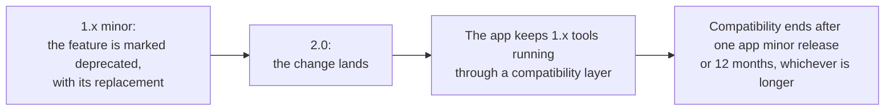

# Versions and compatibility

Which APRScaching instances run my tool, and what may change under it? This page explains how the tool API and the
registry file are versioned, what a tool declares, and what the project promises when the API changes. It is for
tool authors and registry publishers.

## Two versions, apart from the app's

- **The tool API** is what the sandbox offers a tool: the manifest fields, `register`, `tool`, `ipc`, the events,
  the bus rules and the limits. It is versioned as `MAJOR.MINOR`, apart from the app's own releases. APRScaching 1.0
  implements tool API **1.0**.
- **The registry format** is the shape of `registry.json`, named by its `format` field. The project registry is
  format **<!-- registry-format -->**.

An instance shows the tool API it implements in the **Tools** app, and names it as `toolApi` in its descriptor
(`/.well-known/aprscaching`). In the sandbox, `tool.api` gives it as `{ major, minor }`.

## What a tool declares

A manifest's `api` names the lowest tool API the tool needs:

```json
{ "api": "1.0" }
```

The app installs and starts a tool whose `api` has the app's major and a minor no higher than the app's. It refuses
any other tool with the reason: `it needs tool API 1.1; this instance implements 1.0`. `api` is part of the signed
manifest, so a player's app checks it before it runs a byte of the script.

| The tool declares | The instance implements | Result |
|---|---|---|
| `1.0` | 1.0 | Runs |
| `1.0` | 1.3 | Runs: a newer minor only adds |
| `1.2` | 1.0 | Refused: the tool needs features this instance lacks |
| `1.0` | 2.0 | Runs through the compatibility layer while the app keeps one (below), else refused |
| `2.0` | 1.4 | Refused |

## Optional features: `tool.has()`

A tool declares the lowest minor it needs, not the newest it can use. To use a newer feature where the instance has
it, check with `tool.has(name)` and fall back where it does not:

```js
if (tool.has("events.reply")) {
  tool.on("on_connect", (p) => p.reply?.("Welcome"));
} else {
  tool.on("on_connect", (p) => tool.log(`${p.peerCall} connected`));
}
```

`tool.has()` answers for every capability with an API and for each named feature. Every feature a minor adds gets a
name, listed in the [API changelog](changelog.md) and in [the sandbox API](../write/sandbox-api.md#toolapi-and-toolhas).

## What may change within a major

Within a major, the tool API changes only by adding: a new capability, method, event, field, feature name or bus
name. Each addition raises the minor. A tool written for 1.0 runs unchanged on every 1.x instance.

The one exception is safety. A change that narrows what a tool may do, to protect players, may come within a major:
a stricter check on what a tool transmits, say, or a lower budget. It shows as a new permission prompt or as a
refusal with the reason, and the changelog names it under **Narrowed for safety**.

## How a breaking change happens

A change that would break a tool written for the old API raises the major, and it follows these steps:



1. A 1.x minor marks the feature deprecated, names its replacement and adds the replacement where it can. The
   changelog lists both.
2. The next major makes the change.
3. The app keeps tools of the major before it running through a compatibility layer, for at least one app minor
   release or 12 months after the new major ships, whichever is longer.

A tool author has the whole deprecation period to move, and a player's installed tools keep running through it.

## The registry format

`registry.json` names its `format`; the authority signature covers it with the entries, so nobody can change the
format of a signed file. The app refuses a file of a format it does not read, and says so. A new format comes with an
app release that reads it, and a registry keeps publishing the old format until the instances it serves read the new
one.

## The registry's tags

The project registry's tags follow the app's major: `v1.<minor>.<patch>` is a registry for APRScaching 1.x, whose
tools need tool API 1.x. A tag never moves; a fix is a new tag.

## Next

- [API changelog](changelog.md): what each version added, and which app release implements it.
- [The manifest](../write/manifest.md#api): the `api` field.
