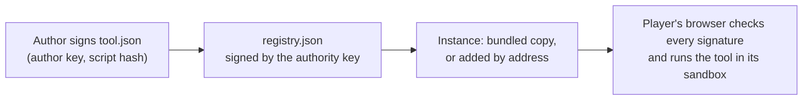

# APRScaching tools

This site documents the project's tool registry for APRScaching 1.x: the tools it lists, how to write a tool, the
tool API and how to publish a registry of your own. It is for tool authors, registry publishers and the registry's
maintainers. Players and sysops find their side in the [APRScaching manual](https://apachler.github.io/aprscaching/).

## What the registry is

A tool adds one job to the Shack's **Tools** app: a decoder, a few `/commands`, a panel, colours in the packet
monitor or markers on the map. The app ships no tools of its own. Every tool, the project's first-party ones
included, comes from a registry, is installed by the player and runs in a sandbox in the player's browser, never on
the instance.

A registry is one signed JSON file. Each entry names a tool, the author key that signs its `tool.json`, and the
address of that `tool.json`. The project registry lives in
[apachler/aprscaching-tools](https://github.com/apachler/aprscaching-tools):

- `registry.json`, signed by the project's authority key;
- `tools/<name>/`, one folder per tool: its manifest, its script and a README;
- the build that bundles each tool from its sources, and the scripts that sign and verify.



## How an instance gets it

- **Bundled.** Each APRScaching release carries a tagged release of this registry, so every instance lists the
  project's tools with no setup. The instance serves the copy from its own address, and it works offline.
- **Added by address.** A sysop adds `github:apachler/aprscaching-tools@vX.Y.Z` in **Instance settings → Tools**
  to follow a newer tag than the bundled one; a player may add the same address in their own **Tools** settings
  when the sysop allows it. A tool listed by both shows once.

Entry addresses are relative to `registry.json`, so the same files work bundled with an instance and served from
`https://raw.githubusercontent.com/apachler/aprscaching-tools/<tag>/registry.json`.

## The authority key

The project's authority key signs the registry. Its Ed25519 public key, base64url:

```text
<!-- authority-key -->
```

The app shows a registry's key as a fingerprint when someone adds it. This key's fingerprint is:

```text
<!-- authority-fingerprint -->
```

The key is in the repository's `authority.pub`, in `registry.json` as `authority`, and pinned in the APRScaching
app as the project registry's key. Compare the fingerprint the app shows with this one before you confirm the
registry, and compare the key in all three places before you trust a copy of it.

## Find your page

| You want to | Read |
|---|---|
| Know what a tool does and which permissions it asks for | [Tool catalogue](catalogue/index.md) |
| Write a tool | [Write your first tool](write/first-tool.md), then the [sandbox API](write/sandbox-api.md) |
| Know which app runs your tool | [Tool API versions](api/index.md) |
| Publish a registry of your own | [How registries work](publish/index.md) |
| List a tool in the project registry | [Contribute a tool](project/contribute.md) |
| Sign and release the project registry | [Maintain the registry](project/maintain.md) |
| Install and use tools as a player | [Tools and plugins](https://apachler.github.io/aprscaching/shack/tools/) in the APRScaching manual |
| Choose an instance's registries as a sysop | [Tool registries](https://apachler.github.io/aprscaching/run/day-to-day/instance-settings/#tool-registries) in the APRScaching manual |

## Next

- [Tool catalogue](catalogue/index.md): every tool in the project registry.
- [Write your first tool](write/first-tool.md): from the scaffold to a signed, tested tool.
