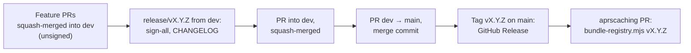

# Maintain the registry

This page is the registry keeper's guide: listing a reviewed tool, building and signing a release, and getting a
tag into an aprscaching release. It is for the project registry's maintainer. At the end a signed tag is on `main`,
published as a GitHub Release, and bundled into the app.

## How a release flows

`dev` is the working branch: every change reaches it by a squash-merged pull request, and a changed tool stays
unsigned there until the next release. `main` holds only fully signed states, and a ruleset lets it change only by
pull request.



## The keys

The private values never enter this repository, CI, a log or the shell history. Keep each one in a file of its own
on the computer that signs (here `~/Development/github/aprscaching-keys/`), holding the value
`node scripts/genkey.mjs --raw` printed, and pass it to one command as `"$(cat <file>)"`.

| Key | File | Signs |
|---|---|---|
| The project's author key (OE8APR) | `oe8apr-tool-author.key` | The project's own tools |
| The authority key | `registry-authority.key` | `registry.json` |

The authority's public key is `authority.pub`:

```text
<!-- authority-key -->
```

## Add or update an entry

1. Review the pull request against [what the review checks](contribute.md#what-the-review-checks). Confirm the
   author key through the channel the author named.
2. Add the entry to `registry.json` under `entries`, in the order the **Registry** list shows them:

    ```json
    {
      "name": "station-log",
      "title": "Station log",
      "author": "OE8APR",
      "version": "1.0.1",
      "pubkey": "<the author's public key, as in tool.json>",
      "entry": "tools/station-log/tool.json",
      "description": "Lists the stations the Station DB tool hears, with /seen and /whois commands."
    }
    ```

    `entry` is relative to `registry.json`, with no leading `/`, so it works bundled with an instance and under
    `raw.githubusercontent.com/apachler/aprscaching-tools/<tag>/`. A tool hosted by its author takes its absolute
    `https://` address. Keep `name`, `title`, `author` and `version` equal to the manifest.

3. The entry is signed with the next release; on `dev` it shows as unsigned. The signature covers the registry's
   `format` and `entries`, their order included, so every change to an entry needs a new signature.

To remove a tool, delete its entry. To change an author's key, update the entry's `pubkey` once the author signs
with the new key.

## Release a tag

Tags follow the aprscaching major: `v1.<minor>.<patch>` is a registry for aprscaching 1.x. The steps for v1.1.0:

1. Cut the release branch from `dev`:

    ```bash
    git fetch origin && git switch -c release/v1.1.0 origin/dev
    ```

2. Fetch the libraries from a local aprscaching clone that holds the `lib.lock` commit, so signing needs no network
   (`git -C ~/Development/github/aprscaching fetch origin` first if the clone lacks it):

    ```bash
    corepack enable && pnpm install --frozen-lockfile --ignore-scripts
    node scripts/fetch-libs.mjs --source ~/Development/github/aprscaching
    ```

3. Sign everything in one step:

    ```bash
    AUTHOR_KEY="$(cat ~/Development/github/aprscaching-keys/oe8apr-tool-author.key)" \
    AUTHORITY_KEY="$(cat ~/Development/github/aprscaching-keys/registry-authority.key)" \
      node scripts/sign-all.mjs
    ```

    `sign-all` checks that every `tool.js` matches its sources; signs each listed `tool.json` with the author key,
    including its `api` and the script's `entrySha256`; copies each manifest's key, title, author and version into
    its registry entry; signs the registry's `format` and `entries` with the authority key; and runs
    `verify.mjs --strict`. A manifest signed by another author's key is left alone, and `sign-all` stops when that
    signature does not hold. The authority key must be the one in `authority.pub`.

4. In `CHANGELOG.md`, rename `## [Unreleased]` to `## [1.1.0] - <date>` and open a new empty `Unreleased` section.
5. Commit, push and open the pull request into `dev`:

    ```bash
    git commit -s -am "chore(release): sign the registry and tools for v1.1.0"
    git push -u origin release/v1.1.0
    gh pr create --base dev --title "chore(release): v1.1.0" --body "Signs the registry and tools for v1.1.0."
    ```

6. Once it is squash-merged into `dev`, open the release pull request from `dev` into `main`, and merge it as a
   merge commit:

    ```bash
    gh pr create --base main --head dev --title "chore(release): v1.1.0" --body "Release v1.1.0."
    ```

7. Tag `main` and push the tag:

    ```bash
    git fetch origin && git tag -a v1.1.0 origin/main -m "registry v1.1.0"
    git push origin v1.1.0
    ```

The tag becomes a GitHub Release, with the CHANGELOG section as its notes (`.github/workflows/release.yml`, which
checks that the tag is on `main` and runs `verify.mjs --strict`). A tag never moves: a fix is a new tag. Instances
that follow `github:apachler/aprscaching-tools@<tag>` read the files at that tag.

## Verify

`node scripts/verify.mjs` checks the registry against the pinned authority (`AUTHORITY`, or else `authority.pub`)
and its `format`, then for each entry: that its `tool.json` exists and names a well-formed `api`, that its signature
verifies with its own `pubkey`, that its script matches `entrySha256`, and that the entry's `pubkey` equals the
manifest's.

A signature that is missing or does not hold is listed as `UNSIG`; on `dev` a changed tool stays unsigned until the
next release. `--strict` fails on those, and on an entry address that leaves the repository when the registry is
served from a subpath. CI runs the plain check on `dev`, and `--strict` on `main`, on pull requests into it and on
release tags.

## Bundle a tag into an aprscaching release

Every aprscaching release ships a registry tag. In a checkout of
[apachler/aprscaching](https://github.com/apachler/aprscaching), on a feature branch cut from `dev`:

```bash
node tools/toolkey/bundle-registry.mjs v1.1.0
```

The script fetches the tag from GitHub and checks the registry's signature against the project key pinned in the
app, each manifest's signature against the author key its entry lists, and each script against its manifest's
`entrySha256`. It writes nothing when any check fails. It copies `registry.json` and the listed tools into the web
app's `public/tools/`, keeping the repository's layout, so the instance serves them from its own address with the
same relative entries. Open the change as a pull request into `dev`; it ships with the next aprscaching release.

When the new tag needs a newer tool API than the app implements, it waits for the app release that implements it
([Tool API versions](../api/index.md)).

## The documentation site

This site is built from `docs/` with MkDocs (`mkdocs.yml`). Every pull request builds it with
`mkdocs build --strict`, and a push to `main` publishes it to GitHub Pages (`.github/workflows/docs.yml`). A new tool
needs its catalogue page: the build fails for a tool folder without one.

## Next

- [Contribute a tool](contribute.md): what a contributor sends you.
- [Keys, rotation and release practice](../publish/keys-and-releases.md): when a key changes or leaks.
