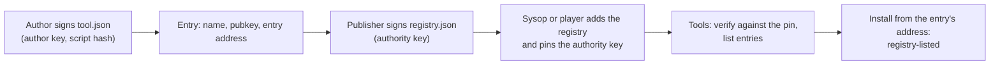

# How registries work

What does a registry promise, and how does the app decide to trust one? This page explains registries end to end:
the signed list, which registries the Tools app shows, how a registry's key is pinned, what the instance does with
them and what a listing does and does not vouch for. It is for anyone who publishes a registry, and for tool authors
who want to be listed in one.

## A signed list of tools

A registry is one signed JSON file: a list of tools, each with the author key that signs it and the address of its
`tool.json`. The **Tools** app lists the tools of every registry the instance and the player switched on. A tool
installed from an entry's address and signed by the key the entry lists shows as **Signed · registry-listed author
key** in the install prompt.

Anyone can publish a registry: a club, a group of authors, one author with several tools. The project registry,
bundled with every instance, is one of them ([The project registry](../project/maintain.md)).

## Which registries the Tools app lists

| Registry | Who adds it | Shown as |
|---|---|---|
| The project registry | Bundled with every release, served by the instance at `/tools/registry.json`. The sysop can switch it off. | **instance** |
| The instance's registries | The sysop, in **Instance settings → Tools**, or `TOOL_REGISTRIES` in the environment | **instance** |
| A player's own registries | The player, in the Tools app, while the sysop allows it | **yours**: added by the player, not checked by the instance |

The app loads each registry on its own: one that fails, is unreachable or has a changed key shows its own state and
does not hold up the others. A tool listed by several registries shows once, under the first that lists it, with
every registry that lists it.

## Pinning a registry's key

The app trusts a registry only under the key someone confirmed for it, never under the key the file names:

1. Whoever adds a registry gives its address. The app fetches the file once and shows the fingerprint of its
   authority key (four groups of four hex digits, such as `3f2a 9c01 bb7e 4d10`), how many tools it lists, and a few
   titles.
2. They compare the fingerprint with the one the publisher gives, in the repository's README, on a website or in
   person, and confirm only when every digit matches. The key is then pinned to the registry.
3. Every later load verifies the file against the pinned key. A file signed by another key shows as **key changed**
   and lists nothing until the same person compares and confirms the new key.

The fingerprint of a key is the first 64 bits of SHA-256 over the raw Ed25519 key, the same form APRScaching's
federation keys use. A publisher states it wherever people find the registry.

## Fetched through the instance

While **Fetch tool registries through this instance** (`TOOL_REGISTRIES_PROXY`) is on, the gateway fetches each
added registry, the manifests its entries name and the scripts those name, and serves them from the instance's own
address:

- A player's address never reaches the registry's host.
- The gateway keeps each file for an hour and serves the last good copy while the host is unreachable, so tools keep
  installing and starting without internet.
- It fetches without cookies, refuses private and LAN addresses unless the instance's federation policy allows them,
  and fetches only files the registry leads to. A registry file may hold 256 KB, a manifest 64 KB, a script 512 KB,
  and one registry's files 4 MB together.
- A player's own registry is fetched for that player alone, and counts against a limit of 60 fetches an hour.

The gateway is only a carrier: the browser verifies every signature against the pinned key and every script against
its manifest's hash. With the setting off, the browser fetches each registry from its publisher, so the publisher's
server must send `Access-Control-Allow-Origin: *`.

## What "registry-listed" covers

- A tool counts as registry-listed only when its manifest was fetched from the exact address its entry names (a
  relative entry resolved against the registry's address) and signed by the key the entry lists. The **Install…**
  button beside an entry uses that address, and the install prompt names the registry.
- A copy of a listed manifest served from any other address is not registry-listed, even when the listed key signed
  it: its script would come from the other site. It gets the trust-on-first-use labels.
- If the manifest at the listed address is signed by another key than the entry's, the install is refused as
  **Author key CHANGED**.
- The manifest's signature covers `entrySha256`, the hash of the script's bytes, and the app runs a script only when
  its bytes match. A listing vouches for the signer, and the hash ties the code to that signature.

A listing vouches for who signed a tool, not for what it does. The permissions the player approves are what limit
it.

## What keeps players safe

- **Tools never run on the instance.** Every tool runs in the player's browser, in a sealed sandbox apart from their
  session, passkeys and stored keys.
- **The browser decides trust.** It checks each registry against its pinned key, each manifest against its author's
  signature, and each script against its signed hash. Nothing the instance or a registry's host serves can widen
  that.
- **Gated abilities need the player's grant.** A tool gets `tx`, `beacon`, `network` and `geo` only when the player
  approves them in the install prompt.
- **Transmitting needs more.** A tool that transmits also needs the player's verified callsign and their transmit
  consent for the tab.

## Limits

- **One key per registry.** A registry is pinned to one authority key; a rotation needs everyone who pinned it to
  confirm the new key.
- **No revocation list.** A removed entry stops vouching; author keys browsers accepted stay accepted.
- **Ten registries per player**, twenty per instance beside the project registry.

## Next

- [Host a registry on GitHub](github.md): publish one with no server of your own.
- [The registry file](registry-file.md): every field and what the signature covers.
