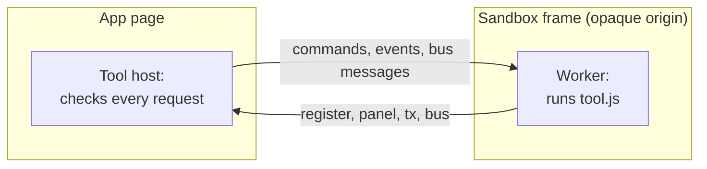
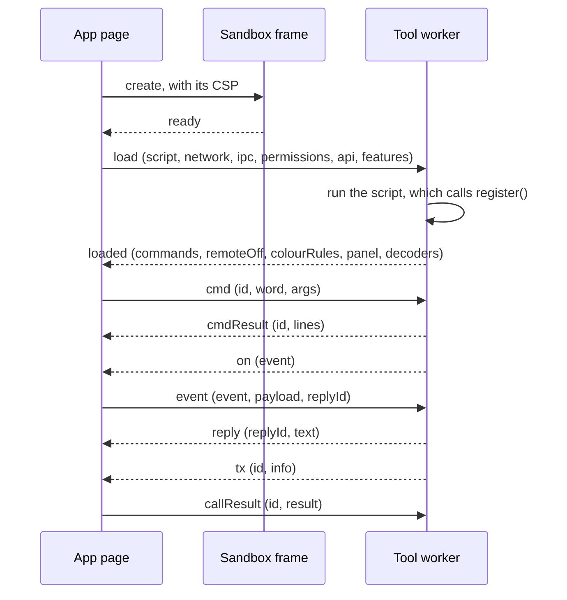

# How a tool runs

How does a tool get from a `tool.json` address to a panel in the Shack, and what keeps it apart from the player's
session? This page explains the install, the sandbox, what the app remembers, and the messages under the
[sandbox API](sandbox-api.md). It is for tool authors who want to know why the API has the shape it has.

## In the player's browser, never on the instance

A tool runs in the player's browser. The instance lists registries and may carry their files, but it never runs a
tool. In the browser, each tool gets a hidden frame of its own with an opaque origin, and inside that frame a Web
Worker that runs the script. The frame cannot reach the app's cookies, session, passkeys or storage, and the worker
has no page to draw on. The tool asks the app for everything it does, through messages, and the app checks each
request against the permissions the player approved.

## The install

1. The player opens **Shack → Tools** and installs the tool from the **Registry** list, or by its manifest address.
2. The app fetches and validates the manifest, checks its signature and decides its trust label
   ([Sign a tool](sign.md#the-trust-labels)).
3. The player reads the prompt (the author, the permissions, where the tool appears, the origins it may reach, the
   trust label) and selects **Approve and install**, or cancels.
4. The app fetches the script, checks it against `entrySha256`, starts the frame and the worker, and runs the script.
   The tool starts switched on.
5. The tool's panel, colour rules and map layer appear on its surfaces; its commands and decoders appear in the Tools
   app; its events, bus messages and transmit requests reach the app.

## What the app remembers

The app records each install in the player's settings: the manifest's address, the author key, the permissions,
`connect` origins and remote use the player approved, and the switch. The record follows the player's account to
their other devices. At every page load the app starts each recorded tool that is switched on and checks it again:

- the signature must verify under the recorded author key;
- the manifest may ask for no permission, origin or remote use beyond the approval;
- the script must match `entrySha256`.

A tool that fails a check stays installed with the reason and does not run. Installing it again approves a new key or
a wider reach.

The installs belong to the identity that made them. Signing out, or another account signing in on the same browser,
stops every tool, ends its beacon and clears the installs on that browser; the account keeps its own.

A tool's own state lives in its worker's variables and ends when the tool stops. Switching a tool off closes its
frame, takes its pin off the rail and ends its beacon; switching it on loads it again from the start. **Remove**
closes its frame, frees its `name` and uninstalls it.

## The messages

The script API is all a tool author needs. Under it, the app's page, the frame and the worker exchange these
messages with `postMessage`. The frame relays them unchanged, and the app drops any message that does not come from
the tool's own frame or does not have one of these shapes. A tool that is switched off reaches nothing.

| Message | Direction | Payload | Notes |
|---|---|---|---|
| `ready` | frame → app | none | The frame is up; the app answers with `load`. |
| `load` | app → worker | `script`, `network`, `ipc`, `permissions`, `api`, `features` | Without `network`, the worker removes the network APIs before it runs the script. `api` (`{ major, minor }`) becomes `tool.api`, and `features` is the list `tool.has()` checks. |
| `loaded` | worker → app | `commands`, `remoteOff`, `colourRules`, `panel`, `decoders` | Lists are cut to 200 entries, colour rules to 40. |
| `error` | worker or frame → app | `error` | The script threw while loading, or the worker failed. Cut to 500 characters. |
| `cmd` · `cmdResult` | app → worker · back | `id`, `word`, `args` · `id`, `lines` | |
| `decode` · `decodeResult` | app → worker · back | `id`, `decId`, `input` · `id`, `out` | `out` is cut to 20,000 characters. |
| `panel` | worker → app | `spec` | Trimmed to the panel limits before display; needs `panel`. |
| `map` | worker → app | `spec` | Trimmed; needs `map`. |
| `colours` | worker → app | `rules` | Needs `monitor`. |
| `log` | worker → app | `msg` | Cut to 300 characters. |
| `on` · `event` | worker → app · back | `event` · `event`, `payload`, `replyId?` | `on_frame` needs `monitor`, the others `event`. |
| `reply` | worker → app | `replyId`, `text` | Needs `event`; four replies per event, for two minutes. |
| `tx` · `beacon` | worker → app | `id`, `info` · `id`, `spec` | Answered with `callResult`. Need `tx` · `beacon` and the transmit gate. |
| `emit` · `subscribe` | worker → app | `topic`, `data` · `topic` | Need `ipc`. |
| `ipcEvent` | app → worker | `topic`, `data`, `from` | A message on a subscribed topic. |
| `call` | worker → app | `id`, `name`, `args` | Needs `ipc`; answered with `callResult`. |
| `callResult` | app → worker | `id`, `result` or `error` | `error` rejects the tool's promise. |
| `provide` | worker → app | `name` | Needs `ipc`. |
| `svcCall` · `svcResult` | app → worker · back | `id`, `name`, `args` · `id`, `result` or `error` | Another tool called the service. |

## Errors an install shows

| Message | Cause |
|---|---|
| `manifest <status>` | The manifest's address answered with an HTTP error. |
| `Failed to fetch` (in Chromium) | The manifest's server is unreachable, or its answer lacks the CORS header. |
| A validation error | See [the manifest](manifest.md#fields). |
| `Refused: Unsigned — refused` | The manifest has no `signature` or no `pubkey`. |
| `Refused: the manifest pins no hash of its code (entrySha256), …` | The signed manifest has no `entrySha256`. Sign it again with `sign.mjs`. |
| `Refused: the tool's code does not match its signed manifest.` | The script's bytes differ from `entrySha256`: the script changed after the manifest was signed, or someone serves other code. |
| `Refused: Signature INVALID — refused` | The signature does not match the manifest. |
| `Refused: Author key CHANGED since you last trusted it — refused` | The key differs from the registry's entry or from the one the player accepted before. |
| `Refused: you already have a tool named "<name>". …` | An installed tool from another address has the name. |
| `Refused: it needs tool API <x.y>; this instance implements <a.b>.` | The tool needs another [tool API version](../api/index.md). |
| `Install failed: the tool did not start in time` | The frame and worker did not report `loaded` within 15 seconds. |
| `Install failed: <message>` | The script threw while loading, or the entry could not be fetched. |

## Next

- [The sandbox API](sandbox-api.md): the calls on top of these messages.
- [Limits and budgets](limits.md): the numbers the app holds each message to.
